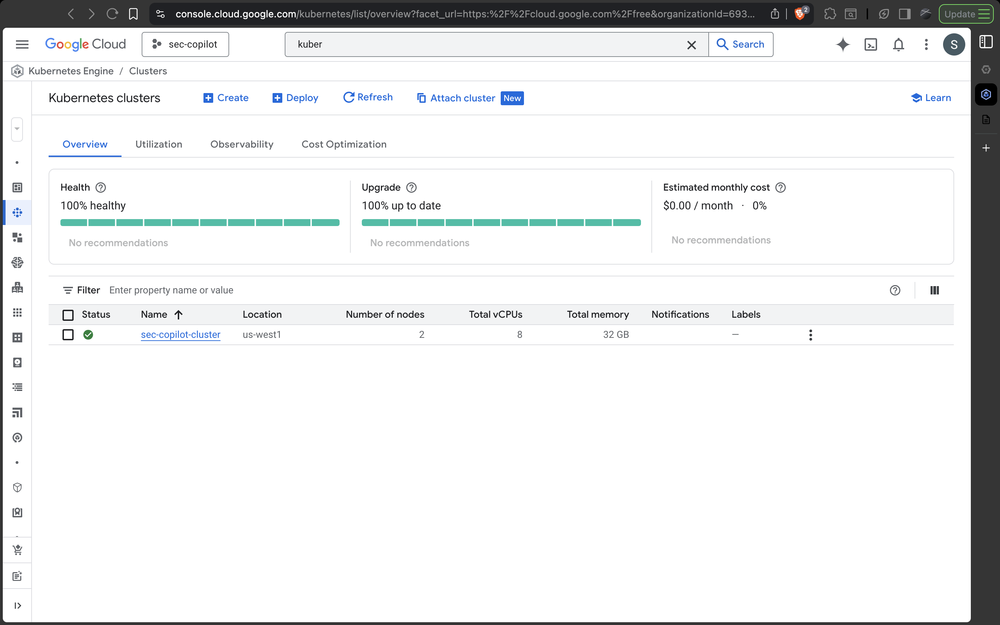
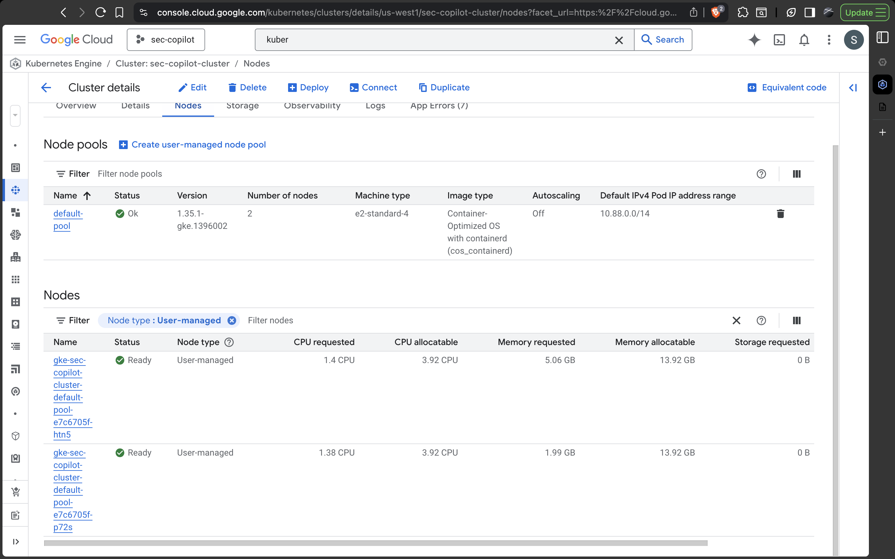
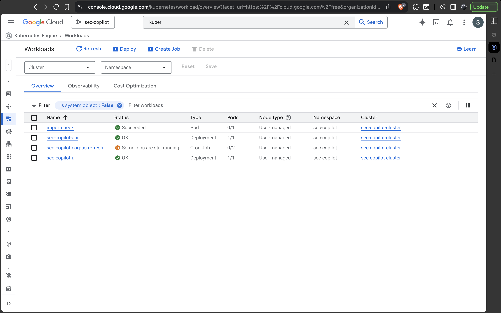
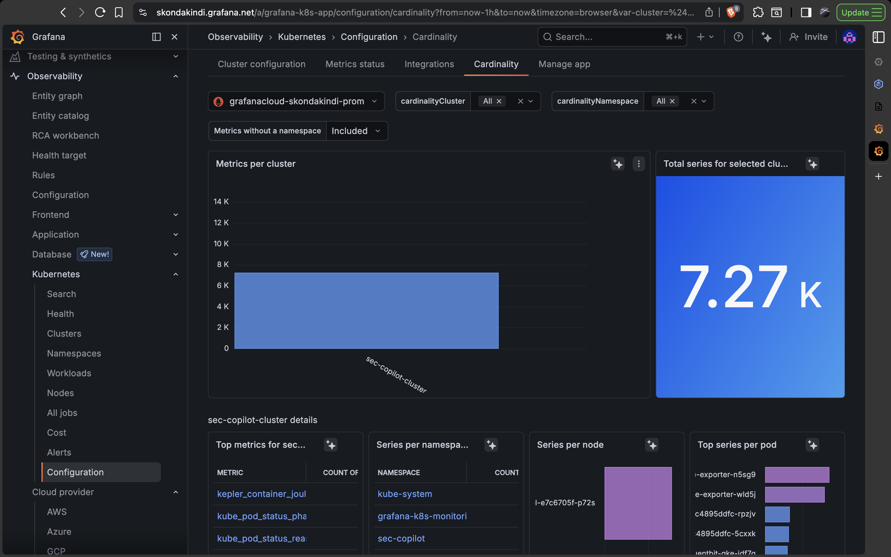
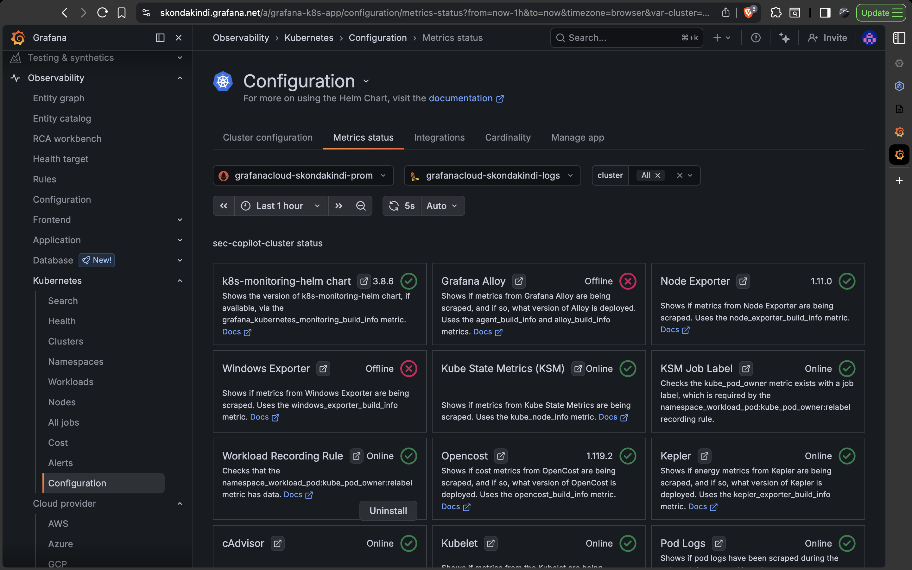
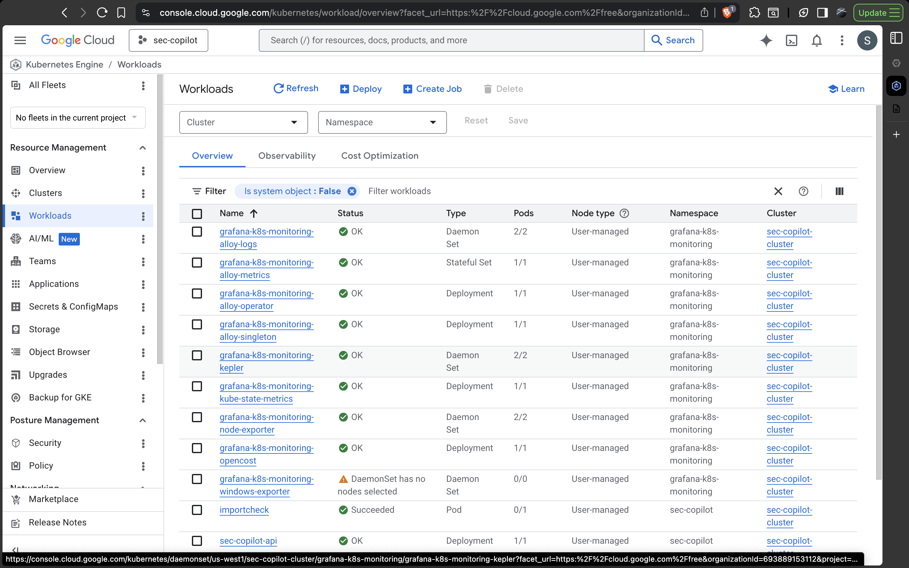
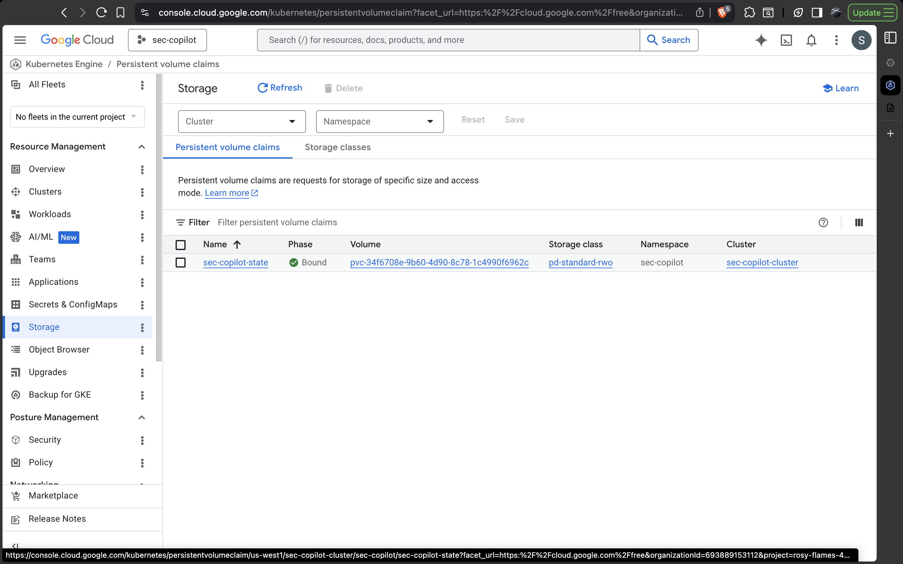

# GKE Deployment Walkthrough

This is the public deployment runbook for the first validated GKE rollout of the SEC Filing Intelligence Copilot.

It is written from the operator/author perspective and reflects the actual sequence used to get the system working on GKE, including the failures that showed up during the first deployment and the fixes that made the rollout reproducible.

## What this deployment includes

- GKE Standard cluster in `us-west1`
- API image and UI image built with Cloud Build and pushed to Artifact Registry
- public UI through GKE Ingress
- internal API through a `ClusterIP` service
- shared PVC for processed corpus and Chroma state
- suspended corpus refresh CronJob for safe manual bootstrap
- Grafana Cloud Kubernetes Monitoring connected in a dedicated `grafana-k8s-monitoring` namespace
- API service annotations that let Alloy scrape `GET /metrics` from inside the cluster

## Architecture assumptions

The current hosted architecture is intentionally honest about state:

- the UI is the only public entrypoint
- the API is internal
- the API and refresh workload share one mounted runtime state volume
- the API does not hot-reload corpus or Chroma state
- the first live bootstrap must run corpus refresh before the API becomes query-ready

That is why the first deployment flow is:

1. build and push images
2. apply the CPU-first GKE overlay
3. run a one-off corpus refresh Job from the CronJob
4. restart the API
5. verify `/health`, `/readyz`, `/build-info`, and a real query

## Prerequisites

- a GCP project
- Cloud Shell access
- Artifact Registry, Cloud Build, and GKE APIs enabled
- a valid SEC user agent string
- an OpenAI API key if live generation should use OpenAI instead of the fallback path

The validated first rollout used:

- region: `us-west1`
- Artifact Registry repo: `sec-copilot`
- cluster name: `sec-copilot-cluster`
- first apply path: `k8s/overlays/gke-cpu-fallback`

## Step 1: Build and push the images

Create the Artifact Registry repository if needed:

```bash
export PROJECT_ID="YOUR_PROJECT_ID"
export REGION="us-west1"
export AR_REPO="sec-copilot"

gcloud config set project "$PROJECT_ID"
gcloud artifacts repositories create "$AR_REPO" \
  --repository-format=docker \
  --location="$REGION" \
  --description="SEC Filing Intelligence Copilot images"
```

Build and push both images with Cloud Build:

```bash
export IMAGE_TAG="$(git rev-parse --short HEAD)"

gcloud builds submit \
  --region="$REGION" \
  --config=cloudbuild.yaml \
  --substitutions=_REGION="$REGION",_AR_REPO="$AR_REPO",_IMAGE_TAG="$IMAGE_TAG"
```

Update the GKE overlay image names and tags to the built Artifact Registry paths:

```bash
sed -i "s|us-central1-docker.pkg.dev/your-gcp-project/your-artifact-repository/sec-copilot-api|${REGION}-docker.pkg.dev/${PROJECT_ID}/${AR_REPO}/sec-copilot-api|g" k8s/overlays/gke-common/kustomization.yaml
sed -i "s|us-central1-docker.pkg.dev/your-gcp-project/your-artifact-repository/sec-copilot-ui|${REGION}-docker.pkg.dev/${PROJECT_ID}/${AR_REPO}/sec-copilot-ui|g" k8s/overlays/gke-common/kustomization.yaml
sed -i "s|newTag: latest|newTag: ${IMAGE_TAG}|g" k8s/overlays/gke-common/kustomization.yaml
```

## Step 2: Create the GKE cluster

The first successful rollout used a Standard cluster with a regional control plane and CPU nodes only:

```bash
export CLUSTER_NAME="sec-copilot-cluster"
export ZONE="us-west1-a"

gcloud container clusters create "$CLUSTER_NAME" \
  --location="$REGION" \
  --node-locations="$ZONE" \
  --machine-type="e2-standard-4" \
  --disk-type="pd-balanced" \
  --disk-size="100" \
  --num-nodes="2" \
  --release-channel="regular" \
  --enable-ip-alias \
  --workload-pool="${PROJECT_ID}.svc.id.goog"

gcloud container clusters get-credentials "$CLUSTER_NAME" --region "$REGION"
kubectl get nodes -o wide
kubectl get storageclass
```

The first deployment path is CPU-first on purpose. The repo keeps the future GPU overlay, but the default live path is the CPU fallback overlay because it removes GPU scheduling as a first-rollout dependency.

## Step 3: Create the namespace and secret

```bash
read -r -p "SEC user agent (Name email): " SEC_USER_AGENT
read -s -r -p "OpenAI API key (press Enter to skip and use fallback): " OPENAI_API_KEY
echo
read -s -r -p "HF token (press Enter to skip): " HF_TOKEN
echo

kubectl create namespace sec-copilot --dry-run=client -o yaml | kubectl apply -f -

kubectl create secret generic sec-copilot-secrets \
  -n sec-copilot \
  --from-literal=SEC_USER_AGENT="$SEC_USER_AGENT" \
  --from-literal=OPENAI_API_KEY="$OPENAI_API_KEY" \
  --from-literal=HF_TOKEN="$HF_TOKEN" \
  --dry-run=client -o yaml | kubectl apply -f -
```

## Step 4: Apply the overlay

```bash
kubectl apply -k k8s/overlays/gke-cpu-fallback
kubectl get all -n sec-copilot
kubectl get pvc -n sec-copilot
kubectl get ingress -n sec-copilot
```

At this point the UI should come up first. The API may still fail readiness because the corpus and index are not present yet.

## What broke in the first rollout, and how it was fixed

### Failure 1: PVC provisioning failed on SSD quota

The first API pod stayed `Pending`, and the key PVC error was:

```text
QUOTA_EXCEEDED: Quota 'SSD_TOTAL_GB' exceeded
```

The root cause was not the app. The first rollout depended on a GKE storage-class path that tried to allocate SSD-backed disk in a project/region with insufficient SSD quota.

The durable fix was to stop assuming `standard-rwo` and instead create a GKE CSI-backed HDD storage class:

- `pd-standard-rwo`
- `pd.csi.storage.gke.io`
- `parameters.type=pd-standard`
- `volumeBindingMode=WaitForFirstConsumer`

The repo now commits that StorageClass in `k8s/overlays/gke-common/pd-standard-rwo-storageclass.yaml` and points the PVC patch at `pd-standard-rwo`.

### Failure 2: `runAsNonRoot` failed because the image user was named, not numeric

Once the PVC bound, the API pod still failed with:

```text
container has runAsNonRoot and image has non-numeric user (sec_copilot), cannot verify user is non-root
```

The image itself was safe, but GKE could not prove that `USER sec_copilot` was non-root from the manifest alone.

The live debug pod showed the image user was:

- UID `999`
- GID `999`

The durable repo fix was to add:

- `runAsUser: 999`
- `runAsGroup: 999`

to:

- `k8s/base/api-deployment.yaml`
- `k8s/base/corpus-refresh-cronjob.yaml`
- `k8s/base/corpus-refresh-job.yaml`

### Failure 3: corpus refresh crashed during index rebuild

The first refresh job ingested filings successfully, then failed when building the Chroma index because the container runtime drifted into an incompatible Torch and Transformers combination.

The working fix was:

- pin `torch==2.4.1` in the Dockerfiles
- pin the validated deployment-only `sentence-transformers` and `transformers` versions with `constraints/docker-runtime.txt`

The repo now commits both of those changes so future image builds reproduce the working runtime instead of relying on transitive dependency drift.

## Step 5: Run the first corpus bootstrap

Do not use the standalone manual Job manifest for the first live bootstrap. The correct first path is to create a one-off Job from the deployed CronJob, because that Job inherits the overlay-applied image name and tag.

```bash
kubectl create job \
  --from=cronjob/sec-copilot-corpus-refresh \
  sec-copilot-corpus-refresh-manual-$(date +%s) \
  -n sec-copilot

kubectl get jobs -n sec-copilot
kubectl logs -f job/$(kubectl get jobs -n sec-copilot -o jsonpath='{.items[-1:].metadata.name}')
```

The first successful refresh rebuilt the corpus and Chroma index for:

- `NVDA`
- `AMD`
- `INTC`
- `AVGO`
- `QCOM`

with:

- latest `2` annual `10-K` filings per company
- latest `4` quarterly `10-Q` filings per company

## Step 6: Restart the API and wait for readiness

After refresh completes, restart the API so the serving pod reloads the mounted runtime state:

```bash
kubectl rollout restart deployment/sec-copilot-api -n sec-copilot
kubectl rollout status deployment/sec-copilot-api -n sec-copilot --timeout=10m
kubectl get pods -n sec-copilot -o wide
kubectl logs deployment/sec-copilot-api -n sec-copilot --tail=100
```

The successful rollout showed:

- `/health` returning `200`
- `/readyz` returning `200`
- model loading succeeding for the embedding model and reranker
- the UI calling the internal API successfully

## Step 7: Verify the first query

Port-forward the internal API service from Cloud Shell:

```bash
kubectl port-forward -n sec-copilot svc/sec-copilot-api 8000:8000
```

In a second Cloud Shell tab, verify health and build metadata:

```bash
curl -s http://127.0.0.1:8000/health | python3 -m json.tool
curl -s http://127.0.0.1:8000/build-info | python3 -m json.tool
```

Run a grounded query:

```bash
curl -s -X POST http://127.0.0.1:8000/query \
  -H 'Content-Type: application/json' \
  -d '{
    "question": "What export control risks does NVIDIA describe?",
    "filters": {
      "tickers": ["NVDA"],
      "form_types": ["10-K"]
    },
    "debug": false
  }' | python3 -m json.tool
```

Run retrieval-only debug:

```bash
curl -s -X POST http://127.0.0.1:8000/retrieve/debug \
  -H 'Content-Type: application/json' \
  -d '{
    "question": "What export control risks does NVIDIA describe?",
    "filters": {
      "tickers": ["NVDA"],
      "form_types": ["10-K"]
    },
    "debug": true
  }' | python3 -m json.tool
```

The validated successful build-info response on GKE reported:

- `retrieve_ready: true`
- `query_ready: true`
- `index_status: fresh`
- `document_count: 30`
- `chunk_count: 4159`

## Public URL and service layout

The public endpoint is the UI Ingress:

```bash
kubectl get ingress -n sec-copilot
```

The API remains internal:

```bash
kubectl get svc -n sec-copilot
```

That split is deliberate. The UI stays public, while the heavier retrieval and generation service remains cluster-internal.

## Grafana Cloud installation

After the application deployment was stable, the next operator step was connecting the cluster to Grafana Cloud Kubernetes Monitoring.

The final working posture is:

- Grafana monitoring workloads installed into `grafana-k8s-monitoring`
- cluster metrics visible in the Grafana UI
- FastAPI `/metrics` scraped from the internal `sec-copilot-api` service
- hosted deployment proof available from both the GKE console and Grafana UI screenshots in this repo

The repo persists the scrape-ready API service annotations in the GKE overlay:

- `k8s.grafana.com/scrape: "true"`
- `k8s.grafana.com/metrics.path: /metrics`
- `k8s.grafana.com/metrics.portNumber: "8000"`
- `k8s.grafana.com/job: sec-copilot-api`

The Helm install came from the Grafana Cloud-generated Kubernetes Monitoring command, but two operator adjustments mattered:

1. install into a dedicated `grafana-k8s-monitoring` namespace instead of mixing monitoring resources into the app namespace
2. remove the erroneous trailing dots from generated Grafana endpoint URLs such as `grafana.net./...`

The first-pass operator recommendation was also to simplify the install if needed by disabling `opencost` and `kepler` rather than debugging extra components before the core metrics and logs path was healthy. The important outcome for this deployment is that Grafana Cloud now shows the cluster and monitoring data is visible in the UI.

## Hosted proof gallery

### Core hosted proof

`GKE cluster overview`



`GKE node pool details`



`GKE workloads overview`



`Grafana Kubernetes cardinality`



`Grafana Kubernetes metrics status`



### Supporting infrastructure proof

`GKE monitoring workloads overview`



`Bound PVC on pd-standard-rwo`



## Why the CPU fallback overlay is the default first path

The CPU overlay is the default first live path because it removes GPU node availability as a rollout dependency while keeping the rest of the architecture the same:

- same public UI and internal API split
- same PVC-backed runtime state
- same refresh-job bootstrap model
- same future path back to GPU nodes when capacity is available

That made it the safest way to get the first hosted deployment working end to end.
