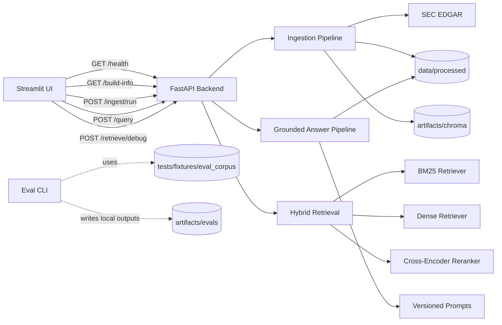

# SEC Filing Intelligence Copilot

A source-grounded SEC filing RAG system with live corpus bootstrap, explicit citations, evidence-first answers, and developer-grade offline evaluation.

## What This Proves

- modular production-style RAG design across ingestion, retrieval, reranking, generation, eval, and serving
- a real local app flow: bootstrap filings, query them, and inspect evidence instead of relying on a static demo
- typed FastAPI contracts with explicit readiness and coverage semantics
- honest failure handling for abstention, missing coverage, backend readiness, and contract drift
- reproducible developer evals over a gold set with deterministic and optional Ragas-backed scoring

## Live App

The portfolio-facing path is now one backend plus one UI:

- start `serve-api`
- start `serve-ui`
- bootstrap a lean five-company corpus from the UI with `1x10-K + 1x10-Q`
- ask a question and inspect the answer, citations, and retrieved evidence chunks

The UI is intentionally thin. It calls only:

- `GET /health`
- `GET /build-info`
- `POST /ingest/run`
- `POST /query`
- `POST /retrieve/debug`

If `OPENAI_API_KEY` is missing, the backend falls back to the mock provider and the UI labels that explicitly. The evidence and citations still come from the live indexed corpus.

See [docs/08_live_app_walkthrough.md](docs/08_live_app_walkthrough.md) for the walkthrough script and recording checklist.

## Architecture At A Glance



The Mermaid source is in [docs/architecture_v6_live.mmd](docs/architecture_v6_live.mmd).

## Quickstart

### 1. Local setup

```bash
make venv
source .venv/bin/activate
make install-dev
```

### 2. Run the app

Terminal 1:

```bash
make serve-api
```

Terminal 2:

```bash
make serve-ui
```

Open the Streamlit URL shown in the terminal, usually `http://127.0.0.1:8501`.

### 3. Bootstrap the live corpus

Use the UI bootstrap panel with the default preset:

- all five companies from `configs/companies.yaml`
- form types: `10-K`, `10-Q`
- annual limit: `1`
- quarterly limit: `1`
- index mode: `rebuild`

If the backend was not started with `SEC_USER_AGENT`, paste a valid SEC user agent into the UI field before running ingest.

### 4. Run a first query

Recommended starter query:

```text
What export control risks does NVIDIA describe?
```

Expected visible output:

- answer block
- citation cards with filing metadata and SEC links
- retrieved evidence chunks
- optional retrieval-debug panel

## Developer Eval Flow

The evaluation path is intentionally separate from the live application.

Deterministic smoke eval:

```bash
make eval-smoke
```

Optional richer local OpenAI plus Ragas run:

```bash
.venv/bin/python -m sec_copilot.eval.cli run --subset ci_smoke --mode full --provider openai --score-backend both --output-dir artifacts/evals/ci_smoke_openai_ragas_retry --fail-on-thresholds false
```

Eval outputs are reproducible local artifacts under `artifacts/evals/`. They are not treated as committed repo assets.

## Benchmark Highlights

Latest validated local deterministic smoke run in this workspace:

- command: `make eval-smoke`
- local output: `artifacts/evals/ci_smoke_latest/report.md`
- retrieval: `hit_rate@4=1.0`, `recall@4=1.0`, `mrr=0.9167`
- answer safety: `citation_validity_rate=1.0`, `abstention_accuracy=1.0`
- answer-quality proxies: `context_precision_proxy=0.6146`, `response_relevancy_proxy=0.7230`, `faithfulness_proxy=0.6931`

Optional richer local OpenAI plus Ragas run:

- command: `.venv/bin/python -m sec_copilot.eval.cli run --subset ci_smoke --mode full --provider openai --score-backend both --output-dir artifacts/evals/ci_smoke_openai_ragas_retry --fail-on-thresholds false`
- local output: `artifacts/evals/ci_smoke_openai_ragas_retry/report.md`
- Ragas: `ragas_faithfulness=0.9667`, `ragas_response_relevancy=0.7841`, `ragas_context_precision=0.5556`

These numbers are local validation results tied to the commands above, the tracked gold set, and the current workspace outputs.

## Known Limitations

- first-run bootstrap depends on live SEC availability and takes time
- without `OPENAI_API_KEY`, answer generation uses the mock fallback
- eval outputs are local artifacts and the eval fixture corpus is narrower than the live five-company universe
- 8-K support is not implemented yet
- admin workflows remain synchronous

## Repository Guide

```text
configs/              Retrieval, prompts, company universe, and eval config
docs/                 Design notes, decision logs, API contracts, walkthroughs, progress
src/sec_copilot/      Ingest, retrieval, rerank, generation, API, frontend helpers
tests/                Unit and integration coverage, gold set, fixture corpora
```

Key docs:

- [docs/01_system_design.md](docs/01_system_design.md)
- [docs/04_eval_plan.md](docs/04_eval_plan.md)
- [docs/05_failure_cases.md](docs/05_failure_cases.md)
- [docs/06_api_contracts.md](docs/06_api_contracts.md)
- [docs/08_live_app_walkthrough.md](docs/08_live_app_walkthrough.md)

## Validation Commands

```bash
.venv/bin/python -m pytest tests/unit/test_frontend_client_v6.py tests/unit/test_frontend_contracts_v6.py tests/unit/test_frontend_helpers_v6.py tests/unit/test_api_v5.py -q
make eval-smoke
make test
```
